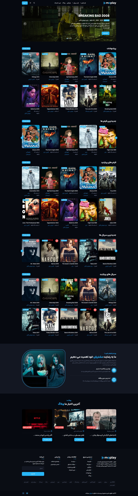

# 🌐 **پروژه فیلم و سریال `Moplay` با جنگو**


## 📋 توضیحات
موپلی یک پلتفرم استریم ویدیوی پیشرفته و کامل است که با استفاده از فریم‌ورک Django توسعه داده شده است. این پلتفرم با تمرکز بر ارائه تجربه کاربری بی‌نظیر، دسترسی به هزاران محتوای جذاب شامل فیلم‌ها، سریال‌ها و مقالات مرتبط را برای کاربران فارسی‌زبان فراهم می‌کند.

## 🚀 ویژگی ها

`صفحات اولیه`
- <b>صفحه اصلی: </b>نمایش فیلم و سریال های دارای رتبه برتر، فیلم و سریال های پیشنهادی، جدیدترین فیلم ها، فیلم های پربازدید، جدیدترین سریال ها، سریال های پربازدید و آخرین مقالات
- <b>صفحه تماس با ما: </b>امکان ثبت پیام برای مدیر
- <b>صفحه درباره ما: </b>نمایش اطلاعات مربوط به پلتفرم موپلی
- <b>صفحه سوالات متداول: </b>نمایش سوالات متداول
- <b>صفحه قوانین و شرایط: </b>نمایش قوانین و شرایط استفاده

`صفحات مربوط به ورود و ثبت نام`
- <b>صفحه ثبت نام: </b>امکان ثبت نام کاربر با نام و نام خانوادگی، ایمیل، رمز عبور و تکرار رمز عبور 
- <b>صفحه ورود: </b>امکان ورود کاربر با ایمیل و رمز عبور
- <b>صفحه تایید کد: </b>تایید کد ارسال شده به ایمیل کاربر

`صفحات مربوط به فیلم و سریال ها`
- <b>صفحه فیلم ها: </b>نمایش تمام فیلم ها با صفحه بندی اصولی و سیستم فیلتر حرفه‌ای
- <b>صفحه جزئیات فیلم ها: </b>نمایش جزئیات فیلم ها و نمایش فیلم و سریال های مشابه و امکان ثبت دیدگاه
- <b>صفحه تماشای آنلاین فیلم ها: </b>امکان تماشای آنلاین فیلم و دانلود آن
- <b>صفحه ژانر فیلم ها: </b>نمایش فیلم های مربوط به ژانر انتخاب شده با صفحه بندی اصولی
- <b>صفحه سریال ها: </b>نمایش تمام سریال ها با صفحه بندی اصولی و سیستم فیلتر حرفه‌ای
- <b>صفحه جزئیات سریال ها: </b>نمایش جزئیات سریال ها و نمایش فیلم و سریال های مشابه و امکان ثبت دیدگاه
- <b>صفحه تماشای آنلاین سریال ها: </b>امکان تماشای آنلاین سریال و دانلود آن
- <b>صفحه لینک دانلود سریال ها: </b>نمایش لینک دانلود سریال انتخاب شده براساس کیفیت مدنظر
- <b>صفحه ژانر سریال ها: </b>نمایش سریال های مربوط به ژانر انتخاب شده با صفحه بندی اصولی
- <b>صفحه برچسب ها: </b>نمایش فیلم و سریال های مربوط به برچسب انتخاب شده با صفحه بندی اصولی
- <b>صفحه کشور ها: </b>نمایش فیلم و سریال های مربوط به کشور انتخاب شده با صفحه بندی اصولی
- <b>صفحه زبان ها: </b>نمایش فیلم و سریال های مربوط به زبان انتخاب شده با صفحه بندی اصولی
- <b>صفحه سال ها: </b>نمایش فیلم و سریال های مربوط به سال انتخاب شده با صفحه بندی اصولی
- <b>صفحه پیشنهادات: </b>نمایش فیلم و سریال های پیشنهادی با صفحه بندی اصولی

`صفحات مربوط به بازیگران`
- <b>صفحه لیست بازیگران: </b>نمایش تمام بازیگران با صفحه بندی اصولی
- <b>صفحه جزئیات بازیگران: </b>نمایش جزئیات بازیگران و آثار آنان 

`صفحات مربوط به کارگردانان`
- <b>صفحه لیست کارگردانان: </b>نمایش تمام کارگردانان با صفحه بندی اصولی
- <b>صفحه جزئیات کارگردانان: </b>نمایش جزئیات کارگردانان و آثار آنان 

`صفحات پنل کاربری`
- <b>صفحه اصلی: </b>نمایش اطلاعات کاربر، اشتراک تهیه شده و موجودی کیف پول 
- <b>صفحه اعلانات: </b>نمایش اعلان ها و حذف خودکار با زمان تنظیم شده توسط مدیر یا ادمین
- <b>صفحه تنظیمات: </b>امکان ویرایش پروفایل و تغییر رمز عبور
- <b>صفحه شارژ کیف پول: </b>امکان شارژ کیف پول به صورت مستقیم

`صفحات مربوط به مقالات`
- <b>صفحه لیست مقالات: </b>نمایش لیست مقالات با صفحه بندی اصولی
- <b>صفحه جزئیات مقالات: </b>نمایش جزئیات مقالات، آخرین مقالات، دسته بندی ها و تگ های برتر
- <b>صفحه دسته بندی مقالات: </b>نمایش مقالات مربوط به دسته بندی انتخاب شده با صفحه بندی اصولی
- <b>صفحه برچسب مقالات: </b>نمایش مقالات مربوط به برچسب انتخاب شده با صفحه بندی اصولی

`صفحات مربوط به اشتراک`
- <b>صفحه لیست پلن ها: </b>نمایش لیست پلن های اشتراک
- <b>صفحه جزئیات پلن ها: </b>نمایش جزئیات پلن ها و پرداخت با کیف پول یا پرداخت به صورت مستقیم
- <b>صفحه جزئیات پلن خریداری شده: </b>نمایش جزئیات پلن خریداری شده با اطلاعات لازم
- <b>صفحه اشتراک کاربران: </b>نمایش لیست اشتراک های خریداری شده کاربر

`دیگر امکانات`
- <b>جستجو فیلم ها و سریال ها: </b>قابلیت جستجوی فیلم ها و سریال ها براساس عنوان
- <b>عضویت در خبرنامه: </b>امکان عضویت کاربران در خبرنامه

## 🛠️ نصب و راه اندازی
برای نصب و راه‌اندازی این پروژه، مراحل زیر را دنبال کنید:

1. **کلون کردن مخزن:**

```bash
git clone https://github.com/arvinmaroufi/Moplay
cd repo
```

2. **ایجاد محیط مجازی (اختیاری):**

```bash
python -m venv venv
source venv/bin/activate  # برای سیستم‌های Unix/Mac
venv\Scripts\activate  # برای ویندوز
```

3. **نصب وابستگی‌ها:**
   
```bash
pip install -r requirements.txt
```

4. **اجرای migrations:**

```bash
python manage.py migrate
```

5. **اجرای سرور:**

```bash
python manage.py runserver
```

6. **دسترسی به وب‌سایت:**
   در مرورگر خود به آدرس http://127.0.0.1:8000/ بروید.

## ✅ استفاده

پس از راه‌اندازی، می‌توانید پروژه رو مشاهده کنید و لذت ببرید.

## 🎯 مشارکت

اگر تمایل به مشارکت در این پروژه دارید، لطفاً مراحل زیر را دنبال کنید:

1. یک فورک از مخزن ایجاد کنید.
2. تغییرات خود را اعمال کنید.
3. یک Pull Request ارسال کنید.

## 🧾 مجوز

این پروژه تحت مجوز MIT منتشر شده است.

## 💻 برنامه نویس

**آروین معروفی** - [لینک پروفایل گیت‌هاب](https://github.com/arvinmaroufi)

## 💬 ارتباط با ما

اگر سوالی دارید یا نیاز به کمک بیشتری دارید، لطفاً با ما تماس بگیرید:

- **ایمیل**: [arvinmaroufi.dev@gmail.com](mailto:arvinmaroufi.dev@gmail.com)
- **گیت‌هاب**: [arvinmaroufi](https://github.com/arvinmaroufi/arvinmaroufi/issues)
- **اینستاگرام**: [arvinmaroufi.ir](https://instagram.com/arvinmaroufi.ir)
- **تلگرام**: [arvin_maroufi](https://t.me/arvin_maroufi)

ما خوشحال می‌شویم که از شما بشنویم 🙏

## ❤️ حمایت از ما

اگر از کار ما لذت می‌برید و می‌خواهید از ما حمایت کنید، لطفاً ما را در شبکه‌های اجتماعی دنبال کنید:

- **گیت‌هاب**: [arvinmaroufi](https://github.com/arvinmaroufi)
- **اینستاگرام**: [arvinmaroufi.ir](https://instagram.com/arvinmaroufi.ir)
- **تلگرام**: [arvinmaroufi_ir](https://t.me/arvinmaroufi_ir)

از حمایت شما سپاسگزاریم 🙏